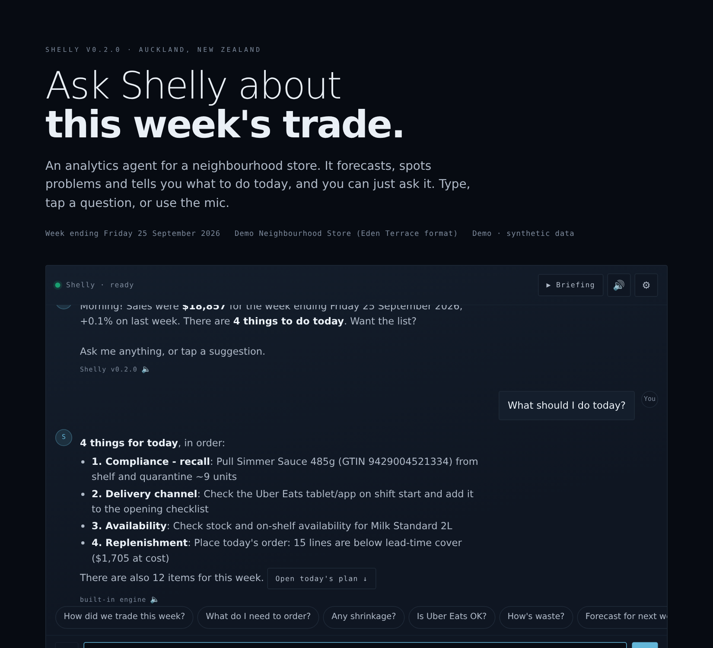
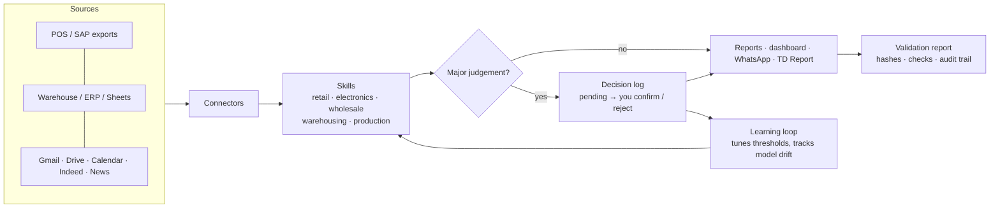
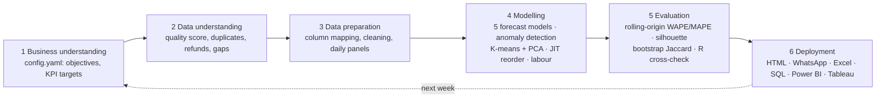

# Shelly: a personal analytics agent for retail and the businesses around it


 

**[🚀 Launchpad](https://pavi44m.github.io/Agent-Shelly-0.3/launchpad/)** · **[▦ Store Floor (3D)](https://pavi44m.github.io/Agent-Shelly-0.3/store/)** · **[▶ Talk to Shelly (live demo)](https://pavi44m.github.io/Agent-Shelly-0.3/)** · [Tōtara Medical Supply Chain Command](https://pavi44m.github.io/Agent-Shelly-0.3/supply-chain/) · **[⛟ Gateway Warehousing & Transport](https://pavi44m.github.io/Agent-Shelly-0.3/gateway/)** · **[🏙 Shelly Tower](https://pavi44m.github.io/Agent-Shelly-0.3/tower/)** · [Example Excel output](docs/example/) · [Portfolio](https://pavi44m.github.io/pavibamunu)



## What's new in v1.12: Shelly Tower (module v1.3), the Shelly Business Tower in Auckland city
- **[Shelly Tower](https://pavi44m.github.io/Agent-Shelly-0.3/tower/)** in 3D, built from *Shelly Business Tower: Integrated Architecture*: a commerce operating system with a building around it, standing in a stylised model of Auckland city (CBD, Sky Tower, Albert Park, Victoria Park, the Viaduct and the Waitematā Harbour; a picture, not survey data).
- **Shelly OS**: six layers (physical building, edge, data fabric and digital twin, Shelly OS, sector services, experiences and open API) with trust and governance down the side; the elevated capabilities (virtual power plant, simulation sandbox, commerce graph) and the new ones (agent mesh, decision ledger, predictive maintenance, building copilot, federated learning, edge plus cloud, self-learning loop).
- **Agent mesh**: Workplace, Retail, Logistics, Trade, Mobility, Energy, Security and Concierge agents negotiate through the orchestrator (live feed), all eight in the Shelly Brain; decision tiers (low acts, medium asks a person, high only advises) and a decision ledger. An MFC order over the limit and a new lease wait in the approvals tray.
- **Nine sectors matched to Shelly's businesses**: offices (group cores and tenants), the experiential mall (Neighbourhood Store), FMCG and the basement micro-fulfilment centre (Gateway), the international trade centre (Tōtara Medical with Gateway), mobility and the rooftop drone hub and vertiport (Gateway and Shelly Energy), health (Rimu Health Clinic and Tōtara), hospitality (hotel, apartments, food hall), innovation (Launchpad, Shelly Ventures and Shelly Academy) and culture (public plaza, Te Reo Māori wayfinding).
- **35 levels** from the rooftop vertiport to the MFC, parking with vehicle-to-grid and the loading dock and battery microgrid; tap any floor and it slides out (deal tables and a globe in the trade centre, hotel rooms, robots running on the MFC grid, EV chargers, AR mirrors and pop-up pods, the Shelly OS video wall).
- **Sustainability, trust, business model and phases**: energy and carbon, privacy and AI governance, ten income streams (synthetic run rate), four phases with gates and the ten success measures against their targets.
- **Two looks**: today and the **Shelly Business Centre in 2050** (twisting garden tower, satellite towers, skyways to the buildings on both sides, garden domes, world map, air taxis, flying cars). `python -m shelly tower` prints the summary.

## What's new in v1.11: Gateway v1.3, a realistic yard, sorting centres and processing centres
- **Two gates, no congestion**: Gate 1 (two lanes in, with a 20 m driveway so waiting trucks are off the road) and a separate Gate 2 (out), each with its own gatehouse officer and live PC. Trucks only turn in or out when there is a real gap in traffic, and oncoming drivers hold back to let them through.
- **One-way yard**: five marshalling lanes where trucks wait to be called, one truck at a time down the dock lane, swing out and reverse straight onto the dock, then leave west to Gate 2. Every truck and car checks the space ahead and the dock lane is locked while a truck reverses on or pulls out, so vehicles never drive through each other (tested with long runs on every site: no overlaps, no gridlock).
- **Fleet park**: eight drive-through bays for Gateway trucks not on a job; they leave forwards along the back lane when called for an outbound load.
- **Sorting centre at every site**: an overhead conveyor from the warehouse to a loop sorter with a chute and roll cage for each business (plus Returns and Exceptions), pick & pack benches, a sort-control desk and a glass manager's office. New roles: Sort Centre Manager, Sort Supervisor, Sort Operative, Pick & Pack Operative, on every shift's roster; a Sorting & Processing Manager in the management team; a Gateway sorting agent in the Brain.
- **Workstations**: live PC screens at both gates, receiving, the planning office, sort control, the manager's office and every pack bench. Tap one to read its screen; the new PCs tab lists them all.
- **Two processing centres**: Gateway Albany Processing Centre and Gateway Airport Processing Centre (Māngere), with bigger sorting halls and more pack benches.

## What's new in v1.10: Gateway v1.2, cold storage, 24/7 shifts and night
- **Cold storage** at every Gateway site: chillers (2–8°C pharma, 2–5°C food), freezers (−20°C) and a chilled cross-dock lane, built as insulated rooms around their racks with strip-curtain doors, cold mist when a forklift goes through, rooftop units and live temperatures (alarm colours outside range). Reefer trucks are put away into the right cold room.
- **Day, afternoon and night shifts** from a real roster: names, stations, staggered breaks, forklift / first-aid / cold-room licences. In 3D the crew clocks in from the car park, takes breaks in the staff room, hands over and goes home; only licensed operators drive forklifts, so the night shift runs fewer. Roster checks (supervisor, first aider, licensed drivers, gate and yard, cold-trained) flag a real gap.
- **Rosters & shifts** section: each site × shift, wages per day (night ×1.25), and a 24-hour chart of crew on site against trucks booked.
- **Day and night**: the sky, sun and shadows follow the clock; yard light towers, office windows, light panels and truck headlights come on at night. Jump to Day / Afternoon / Night / Now.
- **Bolder and smoother**: ink outlines, ribbed walls, painted bay numbers and hazard edges; trucks follow curved paths and their wheels turn; eased zoom and drag; busier yard with road traffic, queues at the gate and replenishment moves in quiet times.

## What's new in v1.9: Gateway Warehousing & Transport (new business, module v1.1)
- **[Gateway](https://pavi44m.github.io/Agent-Shelly-0.3/gateway/)**: Shelly's third business, a third-party logistics company that stores, picks and delivers for the Neighbourhood store, Tōtara Medical, other medical suppliers and food-service operators (all fictional, synthetic data).
- **Three Auckland sites live in 3D** (Wiri DC, Cold Chain, Cross-Dock): trucks book in at the gatehouse, reverse onto a free dock and are unloaded or loaded by forklifts; pickers build orders, receivers check temperatures and ASNs, the yard marshal guides trucks in, the supervisor walks the dock line, drivers wait in the drivers' room. Zoom in and the roof lifts to show the racks. Tap any truck, forklift, person or dock.
- **Control-room cards**: site status, stock vs capacity, clients stored, shipment tracking (order → picked → loaded → in transit → delivered), the docks / forklifts / trucks board and a live feed.
- **The business behind it**: client contracts with OTIF against SLA, what Shelly flagged (service, cold chain, capacity, docks, fleet), decisions that join the approvals tray, Gateway's own management team (General Manager reporting to Pavi), 17 floor and road roles with headcounts ("Show me" finds one in 3D), fleet and the roadmap to v2.0.
- **Brain**: five Gateway agents (warehouse operations, transport planning, cold chain & quality, client accounts, shifts) in the company-wide departments; the business switch now has three businesses. `python -m shelly gateway` prints the summary.

## What's new in v1.8: Shelly guides you
- **Drag Shelly anywhere** (mouse or finger, or arrow keys when she has focus). She stays where you put her, on every visit, until you tap **🏠 Home**.
- **🧭 Guide me**: as you scroll she glides beside the section you're reading and explains it, with this week's numbers where she has them (sales, the top action, the category furthest behind budget, the best forecast model…).
- **Point at anything**: rest the pointer on a section, chart, tile or report for a moment and she flies over, looks at it and explains it. **💬 Ask Shelly** sends a matching question to the chat; **📖 More** opens the section's own "What is this?".
- On phones her message sits along the bottom of the screen so it never runs off the edge. Works on every page (store, floor, Brain, Launchpad, Tōtara Medical).

## What's new in v1.7: Shelly switches on
- **New loading screen for Shelly AI**: a light bulb that switches on as the weekly run finishes. Its filament is the store's last 14 days of sales, the three bands of the base fill as data, models and actions are done, data points drift up into it, and the step list counts up the real figures (rows read, data quality, best model, 7-day forecast, actions). It then flies to Shelly's corner, where the mascot takes over. Quick on repeat visits, Skip any time, calm with reduced motion.
- **One version everywhere**: every page, report and export now shows the running version (no more old v0.1 / v1.2 labels).

## What's new in v1.6: Store Floor, Classic look
- **Classic look (default)**: the live store with one card per category over its shelves (this week's sales and the change on last week, a RECALL badge when one is open), a header with the view ("Sales heat") and a big clock, glass walls, and cards for the checkout (baskets a day), delivery pickup (share of sales) and stockroom. Tap a card to go to the shelf. **Detailed** brings back the sign on every shelf.
- **Hourly timeline** under the floor: customers expected each hour (today's live POS when connected), a strip for floor cover (red under two people), **Now** and **Play the day**, and tap or drag to jump the store to any time.

## What's new in v1.5: Store Floor, points to improve and live trade
- **Improve tab**: points to improve worked out from this week's results, today's rostered team and the store plan: recall, lines below lead-time cover, hours with fewer than two people on the floor, the busiest hour per person, waste over target, the shelf furthest behind budget, delivery-app outages and shelf-space productivity (gross margin per metre of shelf). Tap a point to fly to the shelf.
- **New shelf views**: Stock cover, vs Budget and Forecast (next 7 days), alongside Status, Sales, WoW, Margin and Waste.
- **Delivery drivers** (Uber Eats / On-Demand) come in at the store's delivery share and collect at the counter.
- **Live POS (optional, private)**: `python -m shelly live path/to/till_export.csv --watch 60` writes `docs/data/live.json` (git-ignored, never published); open `store/?live=1` and the shopper rate and Improve tab follow today's real hourly trade.
- **Linked both ways**: every action in the store app has a "🗺 On the floor" link (`store/#cat=<category>&m=<view>`, `store/#fx-<shelf>`).

## What's new in v1.4: Store Floor v3, the store in 3D with the team at work
- **[Store Floor](https://pavi44m.github.io/Agent-Shelly-0.3/store/)** ([`modules/store-floor`](modules/store-floor/)): the Neighbourhood store built in 3D from the printed store plan (1 px = 2 cm): back-wall chillers, produce walls and islands, five grocery aisles, the beer and wine corner, freezer doors, grab & go, hot food, specials and checkout. **Overview** orbits the floor; **Walk** puts you at eye height with a joystick or W A S D.
- **This week's numbers on every shelf.** `shelly/storefloor.py` places each SKU on its fixture (by SKU, then by category; anything that fits nowhere is listed, never dropped) and rolls up 7-day sales, change on last week, margin, waste, lowest stock cover and count variance. Shelves turn **red** (act today: recall, likely stock-out, shrinkage, waste blow-out, under a day of cover), **amber** (watch) or **green**; colour by sales, change, margin or waste instead; gaps on a shelf mean low cover. Tap a shelf for its products, reasons, 14-day trend, report links and the decisions waiting for sign-off (approve from the shelf, same queue as everywhere else).
- **v3: the store team at work.** A trading-day simulation driven by one config block (`operations` in `planogram.yaml`): open 7am–9pm every day; morning shift from 6am and evening shift from 1:30pm, 8 hours each; breaks of 10 min after 2h, 30 min lunch after 4h and 10 min after 6h, staggered so the till is never left empty; deliveries on Tuesday, Thursday and Saturday (unload at the dock, put away in the storeroom, then top up the shelves on the order). The **Duty Manager** works and directs: hands out jobs in person or by 📻 radio, finds cover for the till at break time, walks the floor. Jobs come from Shelly's data (recall pulls, stock-out checks, re-counts, markdowns, top-ups before the after-5pm rush). **Customers** arrive all day from average sales ÷ basket, busiest after 5pm: they browse, say so when a shelf is empty, queue, pay and leave.
- **Checkouts, café and kitchen**: 4 self-checkouts with no staff (a team member or the Duty Manager comes over for alcohol ID checks and scan problems), a main checkout and a separate café till, each with its own person. A cook works every morning shift in the kitchen (baking, hot food to the café cabinet, sandwiches and salads for Grab & Go); in the afternoon one café hand runs the café till until it closes at 4pm, closes the café and kitchen, then tops up and faces up fruit and veg until 9pm.
- **Trolleys and hand baskets**: a few trolleys at the door and a basket stack; customers take either (or neither). Trolleys get left in the car park and baskets pile up at the checkouts, so the team brings them back when they run low.
- **Back of house**: kitchen, storeroom racking, walk-in chiller, manager's office and desk, staff room, restrooms and the receiving dock; people find their way with A* pathfinding on a 25 cm grid.
- **HQ-style panels**: clock with day picker, speeds (1×–180×), jump to 6am / midday / 5pm rush / close / NZ now; **Tasks** (scheduled · waiting · in progress · done, with progress bars), **Team** (who is on, on break, on the till, breaks taken), **Day** (roster bars with breaks, footfall curve, delivery marker, live log).
- `python -m shelly store` prints the same walk-through, worst shelves first. Rebuilt with the site every week (`scripts/build_store.py`).

## What's new in v1.3: Shelly HQ v2, eight departments with heads, approval chains
- **One company, eight departments** that serve every business (store, Tōtara, Group, and any future business): **Management Team** (with Pavi as Managing Director), **Finance** (funds control, payroll, cash), **Sales**, **Inventory**, **Office Manager** (decides shifts and rosters for every business), **HR** (minimum level), **IT** and **Developers**. 43 agents; each department has a head agent and the person accountable, with a spending limit and a monthly budget.
- **Approval chains, department by department:** every request goes first to its own department head; over that head's limit (or any budget, markdown or write-off) Finance does a funds check; over Finance's $10k limit, new-business funding, hiring, policy, pricing, credit and customer terms go to Pavi. Payroll runs Office Manager (confirm shifts) → Finance (approve pay run). The tray and every page show the steps (✓ Inventory Manager › ● Finance Manager › ○ Pavi) and approve "as" the current signer.
- **Shelly HQ v2** (Brain page): a 3D campus with eight department islands around the brain plaza, live cards (agents, doing / next / done, waiting approvals), shirts coloured by the business each agent serves, paper hand-offs and gold sheets flying when an approval moves to the next signer. Tap a department to go in: desks get labels and the left panel becomes its **head**, whom you can ask for status, issues, what's waiting, what's next and budget.
- **Task status** for the whole office or one department (scheduled · backlog · in progress · waiting · done), and a composer that routes a new task to the best agent in a department; add a spend and it joins the right approval chain.
- **Calendar** of every routine (daily, weekdays, weekly, monthly) by department; **Funds** board (budget, spent, approved, pending, left per department); **Opportunities** pipeline for future businesses with scoring and funding requests (Chief of Staff › Finance › Pavi). A funded new business is added with one line in `shelly/brain/registry.py`.
- The orchestrator now knows the new departments ("run payroll", "who is working tomorrow", "should we open a new business").

## What's new in v1.2: Shelly Brain, the Shelly mascot and one approvals inbox
- **Shelly Brain** ([docs/brain](docs/brain/)): an operating map of the AI system, in the style of an "AI brain" consultancy build. 24 agents across 19 departments and 3 businesses (Neighbourhood store, Tōtara Medical, Shelly Group), around 8 core modules (orchestrator, memory, governance, knowledge, learning, reporting, voice, connectors). Each agent card shows its mission, skills, inputs, outputs, triggers, schedule, autonomy level (auto / suggest / approve), guardrails, when it escalates, who it hands off to, its human owner and live KPIs.
- **Shelly HQ** (a 3D office view on the Brain page, with the map as a second tab): one floor per business and one desk per agent. Desk screens show each agent's live numbers; ⚠ marks work waiting for you, 💡 a suggestion, a glow an agent working on its own; paper hand-offs fly between desks; data-source tiles (POS, Excel, Power BI, ERP, Medsafe, news, email) link to the agents that read them, and speech bubbles show real events. Drag to turn, zoom, tap an agent to open its details and approve. Built with three.js (vendored, MIT).
- **Ask the brain**: type a question and the orchestrator shows which department agent takes it, and whether it may act alone or needs your approval. Same logic in Python: `python -m shelly brain ask "what do I need to order?"`.
- **Shelly the mascot** on every page (store, Launchpad, Tōtara, Brain, reports): a light bulb rendered in real 3D with three.js: refracting glass, a glowing coiled filament on support wires, a threaded chrome base, a soft halo and an inner light, supersampled for crisp edges on high-DPI screens. Her face is drawn live on the glass: eyes follow your cursor and blink, and she turns toward you. Her light shows status: warm glow normally, amber pulse when approvals are waiting, a bright flash when you answer one, flicker when dizzy, and the light goes off when she falls asleep. Slow devices drop resolution automatically and fall back to a 2D version of the same character.
- **Shelly reacts** (spring physics, inspired by the Coucou notch mascot; own code and sounds): she breathes, peeks out and waves when you hover, squishes when tapped, gets dizzy on a fast triple-click, does a happy jump when you answer an approval and an alert hop when a new one arrives, gets sleepy and tucks down after a minute idle, and "eats" a file dropped on her (the file is never read on the public site; she tells you the command to load it on your PC). Her face changes with each reaction (wink, squint, spiral eyes, big grin, sleepy) and emotes pop above her head; optional synthesized sounds (off by default, toggle in her bubble).
- **Approvals badge and tray**: one inbox for every decision Shelly will not take alone (store decision log, Tōtara escalations, industry packs). Approve or reject from any page; the answer syncs to the page that owns it.
- Brain data is rebuilt with the site (`scripts/build_brain.py` → `docs/data/brain.js`, `docs/data/approvals.js`).

## What's new: Launchpad and the medical supply-chain module

- **[Launchpad](https://pavi44m.github.io/Agent-Shelly-0.3/launchpad/)**: one page that opens every part of Shelly (retail agent, supply chain, reports, industry packs, decisions, TD Report, skills), each card with a live figure. Rebuilt by `scripts/build_site.py` every week.
- **[Tōtara Medical Supply Chain Command](https://pavi44m.github.io/Agent-Shelly-0.3/supply-chain/)** for a New Zealand importer of medicines, medical consumables and equipment ([`modules/medical-supply-chain`](modules/medical-supply-chain/)): a zoomable supplier → product → client **vision board** where every circle's dot ring shows the last 12 weeks of sales vs plan (or last 12 deliveries for suppliers); zoom in and circles become radial widgets, tap any circle or line for a landing widget with weekly plan vs actual, stock, OTIF and connections. Plus stock-out and reorder points, FEFO expiry risk, inbound shipments with Medsafe/WAND holds, supplier scorecard, SARIMA-X forecasts and client segments (hospitals, medical centres, sports and high-injury industries).
- New **medical** pack skills: `medical.supply_chain` (stock-out, expiry and clearance escalations wait for your confirmation) and `medical.brief`. Shelly's relevance check now accepts supply-chain questions that mention "medical" while still sending medical *advice* questions elsewhere.
- Synthetic data only; its shape is based on how NZ medical-import distributors work.

## What's new in v1.1 (big jump: reports that do the work)

- **Ask for any report in plain words.** "Make a budget for the next 3 months", "13-week forecast for Dairy", "stock report for Beverages in Excel", "roster plan PDF". Shelly works out the report, the time frame and the category, says so when it rounds (5 months → 6-month plan), and is honest when it can't build something.
- **11 report types**: budget & forecast plan (1/3/6/12 months), 13-week forecast (4/8/13 weeks), weekly trading, category review, roster & labour, stock & reorder, waste & shrink, and four industry packs (consumer electronics, wholesale, warehousing, production). Whole store or any category: 137 ready-made report views.
- **Excel workbooks built like an analyst would**: Dashboard (Category dropdown, KPI tiles, charts) · Model (live SUMIFS / INDEX-MATCH / EDATE formulas, nothing typed in) · Pivot (real Excel PivotTables) · Raw (Excel Table) · Lookup · Assumptions (blue inputs: change one and everything recalculates) · Notes (method, data dictionary, sign-off). Formulas carry cached values, so phone previews show numbers too. Zero formula errors, checked on every build.
- **PDF in the Shelly look**: the report page prints in white for paper, in the dark Shelly theme, or as a presentation (one section per screen, arrow keys). `python -m shelly report all --pdf` writes PDFs directly.
- **Planning forecasts with honest ranges**: last year's same period × recent trend, backtested (months and weeks); the 80% range comes from real backtest errors. Budgets flag calendar shifts and months whose "last year" isn't finished.
- **Ready for real data**: CSV/Excel exports (POS, SAP, ERP, accounting; one file or many), SQL databases (read-only SELECTs, credentials from environment variables), automatic column matching with confidence scores, and a data check report (`python -m shelly check --data folder`).
- **Claude/Ollama connection test** in Settings, and a clear reason when the AI engine can't be reached.

## What's new in v0.3.2

- **Self-launching daily briefing**: when the page opens, Shelly greets you by time of day ("Good morning, Pavi") and reads today's briefing aloud: date and time, week sales vs last week and budget, any recall, today's P1 actions and decisions waiting for you. Browsers only allow sound after a first touch, so Shelly tries straight away and otherwise plays on the first tap (with a "Tap to hear" button).
- **Your name, your way**: Settings → You & your day: Pavi, Sir, Ma'am or your own name; briefing every open, first open of the day, or off.
- **Sign-off**: say "done for the day", "good night", "bye" or tap 🌙 Done. Shelly sums up the actions you ticked and decisions still open, then says goodbye to suit the time ("Have a lovely day, Pavi" / "Have a lovely evening, Pavi, and good night").

## What's new in v0.3.1
- **Security hardening.** Content Security Policy on every page, API keys kept for the session only by default, one-click "Clear my data", input limits and LLM rate limits, SQL-identifier validation (raw SQL off by default), no path traversal, HTTPS-only connectors, schema-checked decision imports, Dependabot and [SECURITY.md](SECURITY.md). Every control has a test in `tests/test_security_router.py`.
- **Voices across regions.** 27 regions and languages for speech input and voice: English (NZ, AU, UK, US, IE, CA, IN, ZA, SG, PH), Te reo Māori, Sinhala, Tamil, Hindi, Chinese, Japanese, Korean, Indonesian, Vietnamese, Thai, Filipino, Spanish, French, German, Portuguese and Arabic. Shelly picks the closest installed voice and says so if your device lacks one. Speed, pitch and a test button are included. Answers come in the chosen language when using Claude or Ollama.
- **Relevance check and connected agents.** Every typed or spoken question is checked against Shelly's skills. In scope, the answer shows which skill produced it. Out of scope (travel, email/calendar, writing, coding, investment/medical/legal advice, weather), Shelly explains and tells you which agent to connect in ⚙ Settings → Connected agents (Claude API, Ollama, or OpenJarvis / any OpenAI-compatible local server). It only sends the question after you tap **Send**. Same check on the CLI: `python -m shelly ask "…"`.
- **Depth on demand.** Every dashboard section has a "What is this?" note, plus [16 in-depth guide pages](https://pavi44m.github.io/Agent-Shelly-0.3/guide/) covering what each part shows, how it works, the formulas, how to read it, limits and example questions.
- **TD Report runs unattended.** The scheduled task now carries standing pre-approval for its narrow set of actions: research, the Shelly Drive folder, reading your replies, and emailing only you.

## What's new in v0.3: Shelly Core
- **Every capability is a skill** (21 skills across 5 packs). `python -m shelly skills export` writes an agentskills.io `SKILL.md` for each one, so OpenJarvis or any LLM planner can call them.
- **Industry packs** beyond convenience retail: **consumer electronics** (sell-through, weeks of cover, aged-stock markdowns with a below-cost check, price erosion, attach rate), **wholesale** (customer profitability after cost-to-serve, debtor ageing and DSO, fill rate and OTIF), **warehousing** (ABC-XYZ slotting, pick productivity, capacity runway) and **production** (OEE, scrap cost, schedule adherence).
- **Decision log: you stay in charge.** Big-money, compliance, price, range, credit and markdown judgements are *proposed*, not acted on. They wait as `pending` until you confirm or reject them (CLI, or buttons in the web app plus import). Every event goes into an append-only audit trail.
- **Learning loop.** Shelly tracks how often you confirm each kind of alert (Beta precision) and tunes its own thresholds, within safe bounds and only after 5+ answers. It also tracks its forecast error over time to catch model drift. Every change is logged with its reason.
- **Validation reports** for every run (`reports/<run>/run_report.md`): SHA-256 of each input file, config hash, automated PASS/WARN/FAIL checks (freshness, data quality, beats the baseline, recalls blocked, P&L reconciles, cluster stability), models, decisions and what Shelly learned.
- **Connectors** you can extend: folder/Excel, SQLite, any SQL database, Google Sheets (published CSV), REST/JSON, SMTP email, plus live Gmail, Drive, Calendar, Indeed and web news through Shelly's Claude scheduled tasks. Drop a new connector into `shelly/connectors_ext/` and it's auto-discovered.
- **Daily TD Report.** A Technology & Data newsletter at 6:15am NZ time covering retail and grocery, consumer electronics, wholesale/warehousing/production, AI and data, markets (information only) and matching jobs. Every item is confirmed by 2+ sources or an official source, and it learns from your 👍/👎 replies.



## Everyday commands
```bash
python -m shelly run                         # weekly retail run + decisions + learning + validation report
python -m shelly decisions                   # what's waiting for you
python -m shelly decisions confirm D-1a2b3c4d --note "done"
python -m shelly decisions reject  D-1a2b3c4d --note "false alarm: promo week"
python -m shelly decisions import shelly-decisions.json    # answers exported from the web app
python -m shelly pack electronics            # or wholesale | warehousing | production
python -m shelly learn                       # what Shelly has learned
python -m shelly skills [export]             # list skills / write SKILL.md files
python -m shelly connectors                  # connector health
python -m shelly ask "book me a flight"      # relevance check: skill, or which agent to connect
python -m shelly check --data path/to/exports              # real data: what was found, how columns were matched
python -m shelly report all --data path/to/exports --pdf   # every report: Excel + report page + PDFs in outputs/reports
python -m shelly report budget --months 6 --category Dairy --pdf --theme light,present
```

## What's new in v0.2
- **Ask Shelly.** A chat on the landing page, like talking to Claude. Ask about sales, margin, budget, today's actions, reordering, shrinkage, waste, delivery, forecasts, rostering, segments, models, **any category or any product**. Answers come from the week's computed results, so Shelly never invents a number.
- **Voice.** 🎙 ask by voice (Chrome, Edge, Safari), 🔊 spoken replies, and **▶ Briefing** reads the week's summary and today's priorities aloud. You can pick the voice and speed in ⚙ Settings.
- **Loading sequence** that shows the pipeline running (rows loaded, data-quality score, models backtested, exceptions found).
- **Interactive dashboard.** Hover tooltips on every chart, a tickable action plan that remembers progress, sortable and searchable tables, what-if sliders, and a segment explorer. Tap any number, bar or row to ask Shelly about it.
- **Optional LLM.** Switch the answer engine in ⚙ Settings to **Ollama** (local, private) or the **Claude API** (your key, stored only in your browser). It only receives computed facts, and falls back to the built-in engine if unreachable.
- **Auto-update.** A GitHub Action reruns Shelly every Monday at ~7am NZ time and republishes the site.
- Styled to match [my portfolio](https://pavi44m.github.io/pavibamunu/).

**Shelly** is an analytics agent. Its retail pack reads a convenience store's sales, stock and waste exports and writes the owner's weekly digest. Every Monday it answers three questions: **what happened, what's wrong, and what to do about it today**, with a dollar figure against each action.

It's built as a full **CRISP-DM** pipeline. The forecasting and segmentation methods are the ones from my Master of Applied Business research (SARIMA-X, XGBoost and K-means). The rules come from running a Four Square store day to day: recalls, SAP count variances, Uber Eats outages and short-life waste.

> The demo data is **100% synthetic** (`scripts/generate_sample_data.py`). No employer data is used or published.

---

## What it produces

| Output | For whom |
|---|---|
| `digest_<date>.html` | Owner: dashboard with KPI tiles, action plan, charts, exceptions, reorder list, roster, segments and model evaluation |
| `whatsapp_<date>.txt` | Team: 6-line summary of today's priorities |
| `Weekly_Sales_Digest_<date>.xlsx` | Analyst: category P&L with live formulas, what-if scenario model, pivot-ready tables, SQL results |
| `warehouse.db` + `sql/*.sql` | Analyst: SQLite star schema and KPI queries |
| `powerbi/` | BI: star schema (fact/dim CSVs) and `measures.dax` |
| `tableau/` | BI: tidy extracts ready for a Tableau workbook |
| `actions_<date>.json` | Other agents: machine-readable actions (OpenJarvis skill) |

## CRISP-DM pipeline



## Skills from my CV and where they live in the code

| CV skill | Implementation |
|---|---|
| **Python (pandas, scikit-learn)** | Whole pipeline in `shelly/` |
| **Demand forecasting: SARIMA-X, XGBoost** | `forecasting.py`: SARIMA-X (weekly seasonal, NZ holiday exog) and a global XGBoost with lag features, competing with Naive, Seasonal Naive and Drift baselines |
| **Customer / product segmentation (K-means)** | `insights.segmentation`: K-means + PCA, k picked by silhouette, **bootstrap Jaccard stability** (100 resamples) |
| **R** | `r/validate.R`: independent re-run: silhouette, **gap statistic**, **MANOVA**, and a SARIMA backtest via `stats::arima` |
| **SQL** | `sql/*.sql` run against `warehouse.db` (window functions, CTEs, conditional aggregation) |
| **Power BI (DAX, data modelling)** | `exports.export_powerbi`: star schema + 20+ DAX measures (WoW, YoY, budget, ABC class, rolling 7-day) |
| **Tableau** | `exports.export_tableau`: denormalised extract with segments and forecasts |
| **Advanced Excel (PivotTables, lookups, scenario modelling)** | `exports.export_excel`: Excel Tables, live P&L formulas, what-if model (price elasticity, waste reduction, outage recovery) |
| **Variance and trend analysis** | WoW / YoY / vs budget by category, **price-volume-mix bridge** |
| **Category P&L, KPI design, budget target setting** | `insights.commercial`: category P&L to contribution; budget = LY × (1 + growth) |
| **Range and assortment planning** | `insights.assortment`: ABC/Pareto × segment → delist / protect / review |
| **Capacity and workload planning, rostering** | `insights.labour_plan`: forecast sales ÷ sales-per-labour-hour, with minimum cover |
| **Inventory & stock control, SAP store operations** | SAP vs physical count variance (shrinkage vs receiving/GR errors) |
| **JIT replenishment** (Orel inventory system) | `insights.replenishment`: reorder point, safety stock (z × σ × √(L+R)), shelf-life cap |
| **GS1 compliance and product recall** | GTIN mod-10 check-digit validation; recall notices matched by GTIN; recalled lines blocked from reorder |
| **Liquor licensing compliance** | Flags liquor sold via delivery for ID-verification spot checks |
| **Data quality and integrity** | `data.profile_quality`: scored report (duplicates, refunds keyed as sales, missing values, calendar gaps, orphan SKUs) |
| **Data integration and vendor mapping** | `config.yaml > column_map` maps any POS/SAP export headers to the standard schema |
| **Translating statistics for non-technical audiences** | `strategist.py`: rules engine → prioritised, costed, owner-assigned actions; optional LLM summary |

## Findings on the demo data (what the evaluation shows)

- **Forecasting:** SARIMA-X (16.4% WAPE) and XGBoost (16.6%) both beat the seasonal-naive baseline (21.6%). The agent still picks the winner per category, and XGBoost wins 4 of the 11 (including Dairy and Food To Go). In my thesis the simple baseline won (3.75% vs 5.03% MAPE). The pipeline is built to accept either outcome.
- **R cross-check:** R reproduces the Python backtest almost exactly (SARIMA 16.42% vs 16.40%, seasonal naive 21.63% vs 21.63%).
- **Segmentation:** silhouette picks k=5, but the scores are low (≈0.28). The **gap statistic suggests k=2**, and two clusters have Jaccard stability below 0.6. The digest labels those clusters "Unstable" instead of overselling them. MANOVA confirms the segments differ (Pillai p < 0.001).
- **Exceptions found:** everything that was deliberately injected into the demo data: a 2-day Uber Eats outage, a milk stock-out, shrinkage on chocolate and RTDs, a sandwich waste blow-out, a sushi decline, an unbooked Salsa case, a supplier recall and two broken GTINs.

## Talk to Shelly with a local LLM (optional)
```bash
ollama pull qwen2.5:7b
OLLAMA_ORIGINS="https://pavi44m.github.io" ollama serve   # allow the site to call your local model
```
Then in the site: ⚙ Settings → Ollama. The built-in engine needs no setup.

## Run it

```bash
pip install -r requirements.txt
python scripts/generate_sample_data.py          # synthetic 2-year dataset
python -m shelly.agent --data data/sample # ~35 s
python -m pytest -q                             # 9 tests
python scripts/build_site.py                    # rerun Shelly and refresh the website in docs/
Rscript r/validate.R outputs                    # optional R cross-validation
```

### With an LLM summary
```bash
ollama pull qwen2.5:7b
python -m shelly.agent --data data/sample --llm ollama     # local, private
ANTHROPIC_API_KEY=... python -m shelly.agent --llm anthropic
```
The LLM only receives computed facts (KPIs + actions), never raw rows. If it's unreachable, the digest falls back to the rules engine.

### On real exports
1. Drop `sales`, `products` (and optionally `inventory`, `waste`, `recalls`) as CSV or Excel into `data/real/`. That folder is git-ignored.
2. Map your column headers in `config.yaml > column_map`.
3. Set your KPI targets, labour rate and lead times in `config.yaml`.
4. `python -m shelly.agent --data data/real`

⚠️ Check your employment agreement and data policies before running it on real store data. Never commit real data.

## Use it inside OpenJarvis
Copy `skills/shelly/` into your OpenJarvis skills folder (it follows the agentskills.io `SKILL.md` format). An OpenJarvis agent can then run the digest on request, or on a Monday-morning schedule with the `scheduled-monitor` preset, and read `actions_<date>.json`.

## Project layout
```
shelly/
  agent.py        orchestrator (CRISP-DM phases, CLI)
  data.py         phase 2-3: load, map, quality-score, prepare
  forecasting.py  phase 4-5: 5 models + rolling-origin backtest
  insights.py     commercial, anomalies, segmentation, range, JIT, labour, compliance
  strategist.py   prioritised actions + optional LLM summary
  report.py       HTML digest, Markdown, WhatsApp
  webexport.py    facts bundle for the web app (docs/data/shelly-data.js)
  exports.py      SQLite + SQL, Power BI, Tableau, Excel
docs/             the website: index.html, app.js (chat + voice + charts), app.css
sql/              KPI queries        r/validate.R   R cross-validation
skills/           OpenJarvis skill   tests/         pytest suite
```

## Author
**Pavithra Maduranga Bamunu**, Commercial & Business Analyst, Auckland.
MAppBus (Business Analytics, First Class Honours) · [LinkedIn](https://linkedin.com/in/pavithra-maduranga-19624675) · [Portfolio](https://pavi44m.github.io/pavibamunu)

## Versions
- **v1.3**: eight company-wide departments with heads, approval chains (head → Finance → Pavi), Shelly HQ v2 (campus, head chat, tasks, calendar, funds, opportunities)
- **v1.2**: Shelly Brain (24 agents, 19 departments, orchestrator), light-bulb Shelly mascot, shared approvals badge and tray
- **v1.1**: report engine (Excel with dashboard, formulas, pivots, lookups, raw; PDF and presentation), planning forecasts, real-data intake
- **v0.3.2**: spoken daily briefing on open, time-aware greeting by name, sign-off
- **v0.3.1**: security hardening, 27 voice regions/languages, relevance router with connected agents, section notes and 16 guide pages, unattended TD Report
- **v0.3**: skills registry, industry packs (electronics, wholesale, warehousing, production), decision log with confirmations, learning loop, validation reports, extensible connectors, daily TD Report
- **v0.2**: conversational web app, voice in/out, interactive dashboard, optional LLM, weekly auto-update
- **v0.1**: CRISP-DM pipeline, forecasting, exceptions, digest, Excel/SQL/Power BI/Tableau outputs

## Roadmap
- **v0.4: program & portfolio management.** A register for future business projects (like the Catchment study) with budgets, resources, milestones, a RAID log, stage gates and weekly status reports, all run through the decision log.
- **v0.5: finance hub.** Income, costs and cash flow tracking, business-idea scoring (market size, margin, payback, risk) and reinvestment scenarios. Shelly analyses; you decide. No automated trading and no financial advice.
- Hourly POS data → hour-level rostering and liquor trading-hours checks
- Weather feed as a SARIMA-X / XGBoost regressor (ice cream, drinks, soup)
- Promo-effectiveness model (uplift vs cannibalisation)
- Upload your own CSV in the browser and get a digest (fully client-side)
- Multi-week memory: "how does this compare to last month?"
- Scheduled email/WhatsApp send of the briefing
