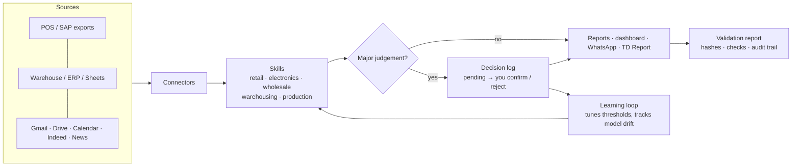
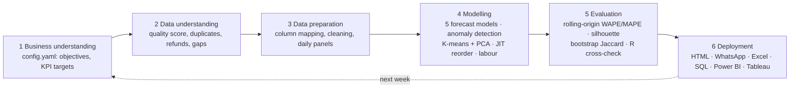

# Shelly: a personal analytics agent for retail and the businesses around it


 

**[▶ Talk to Shelly (live demo)](https://pavi44m.github.io/Agent-Shelly-0.3/)** · [Example Excel output](docs/example/) · [Portfolio](https://pavi44m.github.io/pavibamunu)


## What's new in v0.3.1
- **Security hardening.** Content Security Policy on every page, API keys kept for the session only by default, one-click "Clear my data", input limits and LLM rate limits, SQL-identifier validation (raw SQL off by default), no path traversal, HTTPS-only connectors, schema-checked decision imports, Dependabot and [SECURITY.md](SECURITY.md). Every control has a test in `tests/test_security_router.py`.
- **Voices across regions.** 27 regions and languages for speech input and voice: English (NZ, AU, UK, US, IE, CA, IN, ZA, SG, PH), Te reo Māori, Sinhala, Tamil, Hindi, Chinese, Japanese, Korean, Indonesian, Vietnamese, Thai, Filipino, Spanish, French, German, Portuguese and Arabic. Shelly picks the closest installed voice and says so if your device lacks one. Speed, pitch and a test button are included. Answers come in the chosen language when using Claude or Ollama.
- **Relevance check and connected agents.** Every typed or spoken question is checked against Shelly's skills. In scope, the answer shows which skill produced it. Out of scope (travel, email/calendar, writing, coding, investment/medical/legal advice, weather), Shelly explains and tells you which agent to connect in ⚙ Settings → Connected agents (Claude API, Ollama, or OpenJarvis / any OpenAI-compatible local server). It only sends the question after you tap **Send**. Same check on the CLI: `python -m shelly ask "…"`.
- **Depth on demand.** Every dashboard section has a "What is this?" note, plus [16 in-depth guide pages](https://pavi44m.github.io/Agent-Shelly-0.3/guide/) covering what each part shows, how it works, the formulas, how to read it, limits and example questions.
- **TD Report runs unattended.** The scheduled task now carries standing pre-approval for its narrow set of actions: research, the Shelly Drive folder, reading your replies, and emailing only you.

## What's new in v0.3: Shelly Core
- **Every capability is a skill** (21 skills across 5 packs). `python -m shelly skills export` writes an agentskills.io `SKILL.md` for each one, so OpenJarvis or any LLM planner can call them.
- **Industry packs** beyond convenience retail: **consumer electronics** (sell-through, weeks of cover, aged-stock markdowns with a below-cost check, price erosion, attach rate), **wholesale** (customer profitability after cost-to-serve, debtor ageing and DSO, fill rate and OTIF), **warehousing** (ABC-XYZ slotting, pick productivity, capacity runway) and **production** (OEE, scrap cost, schedule adherence).
- **Decision log: you stay in charge.** Big-money, compliance, price, range, credit and markdown judgements are *proposed*, not acted on. They wait as `pending` until you confirm or reject them (CLI, or buttons in the web app plus import). Every event goes into an append-only audit trail.
- **Learning loop.** Shelly tracks how often you confirm each kind of alert (Beta precision) and tunes its own thresholds, within safe bounds and only after 5+ answers. It also tracks its forecast error over time to catch model drift. Every change is logged with its reason.
- **Validation reports** for every run (`reports/<run>/run_report.md`): SHA-256 of each input file, config hash, automated PASS/WARN/FAIL checks (freshness, data quality, beats the baseline, recalls blocked, P&L reconciles, cluster stability), models, decisions and what Shelly learned.
- **Connectors** you can extend: folder/Excel, SQLite, any SQL database, Google Sheets (published CSV), REST/JSON, SMTP email, plus live Gmail, Drive, Calendar, Indeed and web news through Shelly's Claude scheduled tasks. Drop a new connector into `shelly/connectors_ext/` and it's auto-discovered.
- **Daily TD Report.** A Technology & Data newsletter at 6:15am NZ time covering retail and grocery, consumer electronics, wholesale/warehousing/production, AI and data, markets (information only) and matching jobs. Every item is confirmed by 2+ sources or an official source, and it learns from your 👍/👎 replies.



## Everyday commands
```bash
python -m shelly run                         # weekly retail run + decisions + learning + validation report
python -m shelly decisions                   # what's waiting for you
python -m shelly decisions confirm D-1a2b3c4d --note "done"
python -m shelly decisions reject  D-1a2b3c4d --note "false alarm: promo week"
python -m shelly decisions import shelly-decisions.json    # answers exported from the web app
python -m shelly pack electronics            # or wholesale | warehousing | production
python -m shelly learn                       # what Shelly has learned
python -m shelly skills [export]             # list skills / write SKILL.md files
python -m shelly connectors                  # connector health
python -m shelly ask "book me a flight"      # relevance check: skill, or which agent to connect
```

## What's new in v0.2
- **Ask Shelly.** A chat on the landing page, like talking to Claude. Ask about sales, margin, budget, today's actions, reordering, shrinkage, waste, delivery, forecasts, rostering, segments, models, **any category or any product**. Answers come from the week's computed results, so Shelly never invents a number.
- **Voice.** 🎙 ask by voice (Chrome, Edge, Safari), 🔊 spoken replies, and **▶ Briefing** reads the week's summary and today's priorities aloud. You can pick the voice and speed in ⚙ Settings.
- **Loading sequence** that shows the pipeline running (rows loaded, data-quality score, models backtested, exceptions found).
- **Interactive dashboard.** Hover tooltips on every chart, a tickable action plan that remembers progress, sortable and searchable tables, what-if sliders, and a segment explorer. Tap any number, bar or row to ask Shelly about it.
- **Optional LLM.** Switch the answer engine in ⚙ Settings to **Ollama** (local, private) or the **Claude API** (your key, stored only in your browser). It only receives computed facts, and falls back to the built-in engine if unreachable.
- **Auto-update.** A GitHub Action reruns Shelly every Monday at ~7am NZ time and republishes the site.
- Styled to match [my portfolio](https://pavi44m.github.io/pavibamunu/).

**Shelly** is an analytics agent. Its retail pack reads a convenience store's sales, stock and waste exports and writes the owner's weekly digest. Every Monday it answers three questions: **what happened, what's wrong, and what to do about it today**, with a dollar figure against each action.

It's built as a full **CRISP-DM** pipeline. The forecasting and segmentation methods are the ones from my Master of Applied Business research (SARIMA-X, XGBoost and K-means). The rules come from running a Four Square store day to day: recalls, SAP count variances, Uber Eats outages and short-life waste.

> The demo data is **100% synthetic** (`scripts/generate_sample_data.py`). No employer data is used or published.

---

## What it produces

| Output | For whom |
|---|---|
| `digest_<date>.html` | Owner: dashboard with KPI tiles, action plan, charts, exceptions, reorder list, roster, segments and model evaluation |
| `whatsapp_<date>.txt` | Team: 6-line summary of today's priorities |
| `Weekly_Sales_Digest_<date>.xlsx` | Analyst: category P&L with live formulas, what-if scenario model, pivot-ready tables, SQL results |
| `warehouse.db` + `sql/*.sql` | Analyst: SQLite star schema and KPI queries |
| `powerbi/` | BI: star schema (fact/dim CSVs) and `measures.dax` |
| `tableau/` | BI: tidy extracts ready for a Tableau workbook |
| `actions_<date>.json` | Other agents: machine-readable actions (OpenJarvis skill) |

## CRISP-DM pipeline



## Skills from my CV and where they live in the code

| CV skill | Implementation |
|---|---|
| **Python (pandas, scikit-learn)** | Whole pipeline in `shelly/` |
| **Demand forecasting: SARIMA-X, XGBoost** | `forecasting.py`: SARIMA-X (weekly seasonal, NZ holiday exog) and a global XGBoost with lag features, competing with Naive, Seasonal Naive and Drift baselines |
| **Customer / product segmentation (K-means)** | `insights.segmentation`: K-means + PCA, k picked by silhouette, **bootstrap Jaccard stability** (100 resamples) |
| **R** | `r/validate.R`: independent re-run: silhouette, **gap statistic**, **MANOVA**, and a SARIMA backtest via `stats::arima` |
| **SQL** | `sql/*.sql` run against `warehouse.db` (window functions, CTEs, conditional aggregation) |
| **Power BI (DAX, data modelling)** | `exports.export_powerbi`: star schema + 20+ DAX measures (WoW, YoY, budget, ABC class, rolling 7-day) |
| **Tableau** | `exports.export_tableau`: denormalised extract with segments and forecasts |
| **Advanced Excel (PivotTables, lookups, scenario modelling)** | `exports.export_excel`: Excel Tables, live P&L formulas, what-if model (price elasticity, waste reduction, outage recovery) |
| **Variance and trend analysis** | WoW / YoY / vs budget by category, **price-volume-mix bridge** |
| **Category P&L, KPI design, budget target setting** | `insights.commercial`: category P&L to contribution; budget = LY × (1 + growth) |
| **Range and assortment planning** | `insights.assortment`: ABC/Pareto × segment → delist / protect / review |
| **Capacity and workload planning, rostering** | `insights.labour_plan`: forecast sales ÷ sales-per-labour-hour, with minimum cover |
| **Inventory & stock control, SAP store operations** | SAP vs physical count variance (shrinkage vs receiving/GR errors) |
| **JIT replenishment** (Orel inventory system) | `insights.replenishment`: reorder point, safety stock (z × σ × √(L+R)), shelf-life cap |
| **GS1 compliance and product recall** | GTIN mod-10 check-digit validation; recall notices matched by GTIN; recalled lines blocked from reorder |
| **Liquor licensing compliance** | Flags liquor sold via delivery for ID-verification spot checks |
| **Data quality and integrity** | `data.profile_quality`: scored report (duplicates, refunds keyed as sales, missing values, calendar gaps, orphan SKUs) |
| **Data integration and vendor mapping** | `config.yaml > column_map` maps any POS/SAP export headers to the standard schema |
| **Translating statistics for non-technical audiences** | `strategist.py`: rules engine → prioritised, costed, owner-assigned actions; optional LLM summary |

## Findings on the demo data (what the evaluation shows)

- **Forecasting:** SARIMA-X (16.4% WAPE) and XGBoost (16.6%) both beat the seasonal-naive baseline (21.6%). The agent still picks the winner per category, and XGBoost wins 4 of the 11 (including Dairy and Food To Go). In my thesis the simple baseline won (3.75% vs 5.03% MAPE). The pipeline is built to accept either outcome.
- **R cross-check:** R reproduces the Python backtest almost exactly (SARIMA 16.42% vs 16.40%, seasonal naive 21.63% vs 21.63%).
- **Segmentation:** silhouette picks k=5, but the scores are low (≈0.28). The **gap statistic suggests k=2**, and two clusters have Jaccard stability below 0.6. The digest labels those clusters "Unstable" instead of overselling them. MANOVA confirms the segments differ (Pillai p < 0.001).
- **Exceptions found:** everything that was deliberately injected into the demo data: a 2-day Uber Eats outage, a milk stock-out, shrinkage on chocolate and RTDs, a sandwich waste blow-out, a sushi decline, an unbooked Salsa case, a supplier recall and two broken GTINs.

## Talk to Shelly with a local LLM (optional)
```bash
ollama pull qwen2.5:7b
OLLAMA_ORIGINS="https://pavi44m.github.io" ollama serve   # allow the site to call your local model
```
Then in the site: ⚙ Settings → Ollama. The built-in engine needs no setup.

## Run it

```bash
pip install -r requirements.txt
python scripts/generate_sample_data.py          # synthetic 2-year dataset
python -m shelly.agent --data data/sample # ~35 s
python -m pytest -q                             # 9 tests
python scripts/build_site.py                    # rerun Shelly and refresh the website in docs/
Rscript r/validate.R outputs                    # optional R cross-validation
```

### With an LLM summary
```bash
ollama pull qwen2.5:7b
python -m shelly.agent --data data/sample --llm ollama     # local, private
ANTHROPIC_API_KEY=... python -m shelly.agent --llm anthropic
```
The LLM only receives computed facts (KPIs + actions), never raw rows. If it's unreachable, the digest falls back to the rules engine.

### On real exports
1. Drop `sales`, `products` (and optionally `inventory`, `waste`, `recalls`) as CSV or Excel into `data/real/`. That folder is git-ignored.
2. Map your column headers in `config.yaml > column_map`.
3. Set your KPI targets, labour rate and lead times in `config.yaml`.
4. `python -m shelly.agent --data data/real`

⚠️ Check your employment agreement and data policies before running it on real store data. Never commit real data.

## Use it inside OpenJarvis
Copy `skills/shelly/` into your OpenJarvis skills folder (it follows the agentskills.io `SKILL.md` format). An OpenJarvis agent can then run the digest on request, or on a Monday-morning schedule with the `scheduled-monitor` preset, and read `actions_<date>.json`.

## Project layout
```
shelly/
  agent.py        orchestrator (CRISP-DM phases, CLI)
  data.py         phase 2-3: load, map, quality-score, prepare
  forecasting.py  phase 4-5: 5 models + rolling-origin backtest
  insights.py     commercial, anomalies, segmentation, range, JIT, labour, compliance
  strategist.py   prioritised actions + optional LLM summary
  report.py       HTML digest, Markdown, WhatsApp
  webexport.py    facts bundle for the web app (docs/data/shelly-data.js)
  exports.py      SQLite + SQL, Power BI, Tableau, Excel
docs/             the website: index.html, app.js (chat + voice + charts), app.css
sql/              KPI queries        r/validate.R   R cross-validation
skills/           OpenJarvis skill   tests/         pytest suite
```

## Author
**Pavithra Maduranga Bamunu**, Commercial & Business Analyst, Auckland.
MAppBus (Business Analytics, First Class Honours) · [LinkedIn](https://linkedin.com/in/pavithra-maduranga-19624675) · [Portfolio](https://pavi44m.github.io/pavibamunu)

## Versions
- **v0.3.1**: security hardening, 27 voice regions/languages, relevance router with connected agents, section notes and 16 guide pages, unattended TD Report
- **v0.3**: skills registry, industry packs (electronics, wholesale, warehousing, production), decision log with confirmations, learning loop, validation reports, extensible connectors, daily TD Report
- **v0.2**: conversational web app, voice in/out, interactive dashboard, optional LLM, weekly auto-update
- **v0.1**: CRISP-DM pipeline, forecasting, exceptions, digest, Excel/SQL/Power BI/Tableau outputs

## Roadmap
- **v0.4: program & portfolio management.** A register for future business projects (like the Catchment study) with budgets, resources, milestones, a RAID log, stage gates and weekly status reports, all run through the decision log.
- **v0.5: finance hub.** Income, costs and cash flow tracking, business-idea scoring (market size, margin, payback, risk) and reinvestment scenarios. Shelly analyses; you decide. No automated trading and no financial advice.
- Hourly POS data → hour-level rostering and liquor trading-hours checks
- Weather feed as a SARIMA-X / XGBoost regressor (ice cream, drinks, soup)
- Promo-effectiveness model (uplift vs cannibalisation)
- Upload your own CSV in the browser and get a digest (fully client-side)
- Multi-week memory: "how does this compare to last month?"
- Scheduled email/WhatsApp send of the briefing
