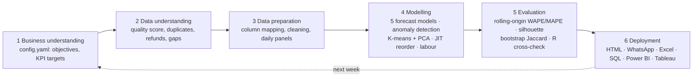

# Shelly v0.1: Retail Sales Digest Agent


 

**[▶ Live demo digest](https://pavi44m.github.io/Shelly-0.1/)** · [Example Excel output](docs/example/) · [Portfolio](https://pavi44m.github.io/pavibamunu)


**Shelly** is an analytics agent that reads a convenience store's sales, stock and waste exports and writes the owner's weekly digest. Every Monday it answers three questions: **what happened, what's wrong, and what to do about it today**, with a dollar figure against each action.

It's built as a full **CRISP-DM** pipeline. The forecasting and segmentation methods are the ones from my Master of Applied Business research (SARIMA-X, XGBoost and K-means). The rules come from running a Four Square store day to day: recalls, SAP count variances, Uber Eats outages and short-life waste.

> The demo data is **100% synthetic** (`scripts/generate_sample_data.py`). No employer data is used or published.

---

## What it produces

| Output | For whom |
|---|---|
| `digest_<date>.html` | Owner: dashboard with KPI tiles, action plan, charts, exceptions, reorder list, roster, segments and model evaluation |
| `whatsapp_<date>.txt` | Team: 6-line summary of today's priorities |
| `Weekly_Sales_Digest_<date>.xlsx` | Analyst: category P&L with live formulas, what-if scenario model, pivot-ready tables, SQL results |
| `warehouse.db` + `sql/*.sql` | Analyst: SQLite star schema and KPI queries |
| `powerbi/` | BI: star schema (fact/dim CSVs) and `measures.dax` |
| `tableau/` | BI: tidy extracts ready for a Tableau workbook |
| `actions_<date>.json` | Other agents: machine-readable actions (OpenJarvis skill) |

## CRISP-DM pipeline



## Skills from my CV and where they live in the code

| CV skill | Implementation |
|---|---|
| **Python (pandas, scikit-learn)** | Whole pipeline in `shelly/` |
| **Demand forecasting: SARIMA-X, XGBoost** | `forecasting.py`: SARIMA-X (weekly seasonal, NZ holiday exog) and a global XGBoost with lag features, competing with Naive, Seasonal Naive and Drift baselines |
| **Customer / product segmentation (K-means)** | `insights.segmentation`: K-means + PCA, k picked by silhouette, **bootstrap Jaccard stability** (100 resamples) |
| **R** | `r/validate.R`: independent re-run: silhouette, **gap statistic**, **MANOVA**, and a SARIMA backtest via `stats::arima` |
| **SQL** | `sql/*.sql` run against `warehouse.db` (window functions, CTEs, conditional aggregation) |
| **Power BI (DAX, data modelling)** | `exports.export_powerbi`: star schema + 20+ DAX measures (WoW, YoY, budget, ABC class, rolling 7-day) |
| **Tableau** | `exports.export_tableau`: denormalised extract with segments and forecasts |
| **Advanced Excel (PivotTables, lookups, scenario modelling)** | `exports.export_excel`: Excel Tables, live P&L formulas, what-if model (price elasticity, waste reduction, outage recovery) |
| **Variance and trend analysis** | WoW / YoY / vs budget by category, **price-volume-mix bridge** |
| **Category P&L, KPI design, budget target setting** | `insights.commercial`: category P&L to contribution; budget = LY × (1 + growth) |
| **Range and assortment planning** | `insights.assortment`: ABC/Pareto × segment → delist / protect / review |
| **Capacity and workload planning, rostering** | `insights.labour_plan`: forecast sales ÷ sales-per-labour-hour, with minimum cover |
| **Inventory & stock control, SAP store operations** | SAP vs physical count variance (shrinkage vs receiving/GR errors) |
| **JIT replenishment** (Orel inventory system) | `insights.replenishment`: reorder point, safety stock (z × σ × √(L+R)), shelf-life cap |
| **GS1 compliance and product recall** | GTIN mod-10 check-digit validation; recall notices matched by GTIN; recalled lines blocked from reorder |
| **Liquor licensing compliance** | Flags liquor sold via delivery for ID-verification spot checks |
| **Data quality and integrity** | `data.profile_quality`: scored report (duplicates, refunds keyed as sales, missing values, calendar gaps, orphan SKUs) |
| **Data integration and vendor mapping** | `config.yaml > column_map` maps any POS/SAP export headers to the standard schema |
| **Translating statistics for non-technical audiences** | `strategist.py`: rules engine → prioritised, costed, owner-assigned actions; optional LLM summary |

## Findings on the demo data (what the evaluation shows)

- **Forecasting:** SARIMA-X (16.4% WAPE) and XGBoost (16.6%) both beat the seasonal-naive baseline (21.6%). The agent still picks the winner per category, and XGBoost wins 4 of the 11 (including Dairy and Food To Go). In my thesis the simple baseline won (3.75% vs 5.03% MAPE). The pipeline is built to accept either outcome.
- **R cross-check:** R reproduces the Python backtest almost exactly (SARIMA 16.42% vs 16.40%, seasonal naive 21.63% vs 21.63%).
- **Segmentation:** silhouette picks k=5, but the scores are low (≈0.28). The **gap statistic suggests k=2**, and two clusters have Jaccard stability below 0.6. The digest labels those clusters "Unstable" instead of overselling them. MANOVA confirms the segments differ (Pillai p < 0.001).
- **Exceptions found:** everything that was deliberately injected into the demo data: a 2-day Uber Eats outage, a milk stock-out, shrinkage on chocolate and RTDs, a sandwich waste blow-out, a sushi decline, an unbooked Salsa case, a supplier recall and two broken GTINs.

## Run it

```bash
pip install -r requirements.txt
python scripts/generate_sample_data.py          # synthetic 2-year dataset
python -m shelly.agent --data data/sample # ~35 s
python -m pytest -q                             # 8 tests
Rscript r/validate.R outputs                    # optional R cross-validation
```

### With an LLM summary
```bash
ollama pull qwen2.5:7b
python -m shelly.agent --data data/sample --llm ollama     # local, private
ANTHROPIC_API_KEY=... python -m shelly.agent --llm anthropic
```
The LLM only receives computed facts (KPIs + actions), never raw rows. If it's unreachable, the digest falls back to the rules engine.

### On real exports
1. Drop `sales`, `products` (and optionally `inventory`, `waste`, `recalls`) as CSV or Excel into `data/real/`. That folder is git-ignored.
2. Map your column headers in `config.yaml > column_map`.
3. Set your KPI targets, labour rate and lead times in `config.yaml`.
4. `python -m shelly.agent --data data/real`

⚠️ Check your employment agreement and data policies before running it on real store data. Never commit real data.

## Use it inside OpenJarvis
Copy `skills/shelly/` into your OpenJarvis skills folder (it follows the agentskills.io `SKILL.md` format). An OpenJarvis agent can then run the digest on request, or on a Monday-morning schedule with the `scheduled-monitor` preset, and read `actions_<date>.json`.

## Project layout
```
shelly/
  agent.py        orchestrator (CRISP-DM phases, CLI)
  data.py         phase 2-3: load, map, quality-score, prepare
  forecasting.py  phase 4-5: 5 models + rolling-origin backtest
  insights.py     commercial, anomalies, segmentation, range, JIT, labour, compliance
  strategist.py   prioritised actions + optional LLM summary
  report.py       HTML dashboard, Markdown, WhatsApp
  exports.py      SQLite + SQL, Power BI, Tableau, Excel
sql/              KPI queries        r/validate.R   R cross-validation
skills/           OpenJarvis skill   tests/         pytest suite
```

## Author
**Pavithra Maduranga Bamunu**, Commercial & Business Analyst, Auckland.
MAppBus (Business Analytics, First Class Honours) · [LinkedIn](https://linkedin.com/in/pavithra-maduranga-19624675) · [Portfolio](https://pavi44m.github.io/pavibamunu)

## Roadmap
- Hourly POS data → hour-level rostering and liquor trading-hours checks
- Weather feed as a SARIMA-X / XGBoost regressor (ice cream, drinks, soup)
- Promo-effectiveness model (uplift vs cannibalisation)
- Streamlit front-end and a scheduled email/WhatsApp send
